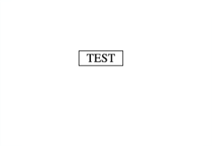

# A light weight Tooltip using CSS only

tooltip was created because I wanted to practice and writing lightweight CSS libraries for tooltip. So feel free to fork and create pull requests!

Written by [Mohammad Ahshan Danish](https://github.com/mailtodanish).

_**demo**_


## Variables

```
--background-color:red;
```

## html

```
 <link rel="stylesheet" href="tooltip.css">

 <div class="tooltip" data-tool-tip="I am testing">TEST</div>

 .tooltip{
    --background-color:black;
 }

// LEFT

 <div class="tooltip" data-tool-tip-left="I am testing">TEST</div>
 ```

 ## minify version

 ```
 tooltip.min.css
 ```

 ##

 npm install

 npm run build